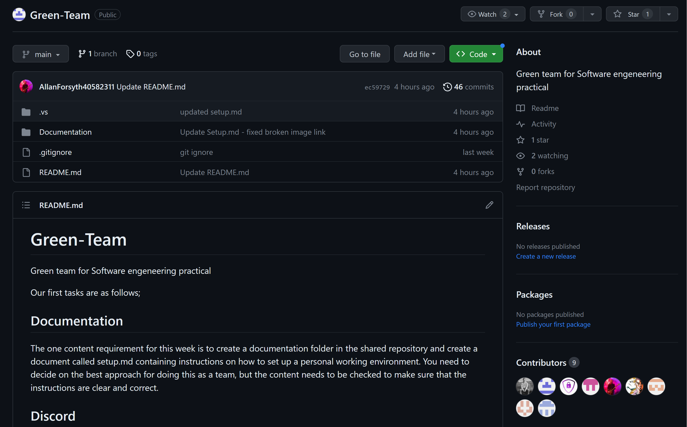

# Setup: Visual Studio and GitHub

## Introduction

The contents of this section of my personal repository are to satisfy the requirements for the first active
week of portfolio work. This week is focusing on the setup of all of the software required to move forward with
the group project. As the groups are relatively large and most members of the group are coming from completely
different backgrounds, this is more difficult than it may seem. Some members of the group, myself included, do
not have the expected skills due to the direct access path that was taken to get to this point on the course
from another organisation. I have not previously completed the methods module, used GitHub, linked my Visual
Studio to another entity, or cloned repositories. Due to the mixed skill base in the group it is expected that
a buddy system be implemented to marry up members of the team with people who possess the skills the other may
lack.

This will be completed by displaying screenshots with helpful additions added to the screenshots. Arrows to
point out important aspects for instance. I will give descriptions and then later on discuss my understanding 
and reflect on everything as the task requires.

## Prerequisites

* I ensured [Visual Studio](https://visualstudio.microsoft.com/) was installed on my laptop, taking care to use the latest version 2022 as that is what the university is using.
* I created a [GitHub](https://github.com) account as this was something I had never used before.
* Make best efforts to use my own laptop at all times.

## 1.0 Creating a Shared GitHub Team Repository 

### 1.1 Designating a Repository Creator

Our team had to hold a meeting right away and communicate to each other what our experience and skillsets
consisted of as most of us were new to each other. In this meeting we hashed out what parts of the
setup people needed help with due to inexperience and buddied them up with a person or persons
to rectify this. We also implemented a team discord server to make communication easier moving forward.
Next on the agenda was to identify who would create the shared team repository.
This was left to the two most experienced team members who had previously completed the 
prerequisities to achieve this, including the methods module in the previous year.

||
||:--:|| 
|<b>Fig.1 - Team Repository</b>|

In Fig.1 it demonstrates the main page of our shared team repository for the group project which shows our team
name, the Green-Team, and all other relelvant information to our team. Fig.1 also shows our first post
which outlines to the team the task at hand and the details for the team Discord channel for easy communication.
From here I can proceed to anywhere, like the project board for example.

### 1.2 Repository Initialisation

Even though I did not personally create this repository I would outline the basic steps on how to do it
below:

* Go to [GitHub](https://github.com) and login to your account.
* Create a new repository.
* Name the repository appropiately with the project context in mind.
* Set the appropriate permission level. If only team members should have access then set to private.
* Initialise the repository by implementing a README file.

## 2.0 Setting up a GitHub Project with an Integrated Task Board

Again, just like the creating of the repository, I did not physically create the integrated task board.
That was again left to the same two team members who felt like they had the most experience. However,
as this still benefits me I will walk through how to do this and provide a screenshot of the setup team
project with integrated task board.

* Ensure currently within the created team GitHub repository and then navigate to the projects tab.
* Click on "Create a project".
* Define the required parameters like project name, description and template.
* After project creation, implement the required columns. To Do, In Progress, and Done are good columns
* to add at the start.

Please see all of the above come to fruition in the below Fig.2.

| 
||:--:|| 
|<b>Fig.2 - Team Project Task Board</b>|

## 3.0 Configuring Visual Studio

As I had used Visual Studio in previous years for a couple of small projects, I already had the program installed
and did not therefore need to go through the process of installing it. This was a time saver as Visual
Studio is quite a large piece of software if you choose to install a lot of the options available.

However, upon reading the project brief I realised there was a need for the .NET MAUI template for use
at a later date. As I did not have this installed I searched for the .NET Multi-Platform App UI
Development within Visual Sutdio and installed it. You can see this below in Fig.3.

| 
||:--:|| 
|<b>Fig.3 - Team Project Task Board</b>|

## 4.0 Cloning the Shared Repository

The final step in ensuring all my development environment was correctly setup to progress with the
project is to clone the shared repository in Visual Studio. This way I can work within Visual Studio
using the markdown language and push any work I do onto the GitHub repository.

This can be done two ways inside Visual Studio and I used both. One way for my shared repository and
one way to clone the template for my own personal repository. My personal opinion is both ways are as
easy as each other. Below is some screenshots and instructions for how I did this:

| 
||:--:|| 
|<b>Fig.4 - Clone Repository with URL</b>|

To clone the repository as in Fig.4:
* Open Visual Studio and click on Clone a repository on the top left.
* Go to the repository on GitHub and retrieve the URL and enter this into repository location box.
* Double check the file path is correct.
* Click Clone button.

| 
||:--:|| 
|<b>Fig.5 - Clone Repository with Account</b>|

To clone the repository as in Fig.5:
* Open Visual Studio and click on Clone a repository on the top left.
* Click on the GitHub logo under Browse a repository.
* Either select your account from the dropdown on the top right or add your account if not there.
* Select the repository you would like to clone.
* Click the Clone button.

# Reflection on Setup: Visual Studio and GitHub

## Initial Challenges and Difficulties

Setting up my working environment came with a steep learning curve and provided me with a plehtora of challenges.
This was mainly due to the fact that I was not familiar with many of the tools that I am required to use, and the
one tool that I have used before, Visual Studio, I am not very comfortable with. Integrating Visual Studio with
GitHub was something that I was previously completely unaware was even possible and carrying out this task involved
doing things I had never done before.

GitHub itself has come with a steep learning curve as this is a completely new tool to me. Navigating my way around
the site alone was a little challenging at the beginning. Using and understanding Git commands is still a little
daunting, but I am getting used to them now. Things like .gitignore which ignore files in Git repositories and 
essentially make them invisible. This is useful for things like temporary files.

The deep integration of Visual Studio with GitHub has presented a lot of challenges. Trying to understand the difference
in branches and ensuring I am committing to the correct branch has been difficult as I have no formal training with
this previously. Moreover, when I run into errors when pushing, pulling, syncing, or committing, it can be very
difficult to fix the issue. 

Luckily, members of my team with more experience with this have been on hand to help. I overcame all of these obstacles
by getting assistance from my team members and spending time familiarising myself with the tools.

## Limitation of Configuration

I am using the [Visual Studio Community Edition](https://visualstudio.microsoft.com/vs/community/) which is the only free
edition available to students. I would assume this will come with a certain level of limitations over the other more
expansive editions, however, I do not forsee this being an issue with this project. Moreover, I am using the free
version of GitHub which I assume will also have limitations over the paid for service. Again, I don't see this being
an issue with this particular project.

GitHub has limitations on file uploads and repository sizes. This even holds true on the paid for versions of the 
service. If the project progresses to be large, or maybe contain large datatsets, then we could potentially run into
these size limitations and have to find alternative storage solutions.

As the team are working from a shared repository there is a possibility for merge conflicts to occurr if two or more
people happen to edit the same file simultaneously.

There is a lot of potential for error with the limitations of the teams individual and group abilities. There is a
rather steep learning curve here to fully understand these tools and this could lead to a slower setup and definite
misconfigurations.

## Appropriate Configuration for the Project

Visual Studio is a very powerful IDE that is packed with features, tools, and extensions. This allows for versatility
with a lot of aspects of software engineering including development, debugging, testing, and deployment. This creates
a very efficient work environment for developers to work within.

As we are working in fairly large teams of around 16 members, GitHub is an amazing platform for allowing multiple
developers to be working on the same project simultaneously. GitHub helps to create a smooth collaboration as it
prevents developers from overwriting each others work. Moreover, it creates a central focal point for developers to
even contact each other and complete tasks through features like the project task board. Other features like pull
requests, discussions, and issues help to facilitate excellent communication and collaboration.

Although tasks can be completed on GitHub itself, the integration aspect of Visual Studio with GitHub allows for 
a lot of tasks to completed from the IDE and pushed to GitHub. This is ideal for developers, especially ones who are
extremely comfortable with this particlar IDE.

The way this configuration is built allows for excellent scalability and accessibility. Both tools can handle very
complex builds, like builds with multiple solutions and repositories. Moreover, as GitHub is cloud based it is
accessible by everyone, anywhere, at the same time.

## Alternatives to the Configuration

There are a myriad of other tools out there that I could configure and work with to complete this project that would
work adequately to complete the tasks. Below are but a few:

<b>IDEs and Editors</b>

* Visual Studio Code
* Eclipse
* IntelliJ
* Atom

<b>Version Control Systems</b>

* GitLab
* BitBucket
* Mercurial
* Subversion

<b>CI/CDs</b>

* Jenkins
* Travis CI
* CircleCI
* Bamboo