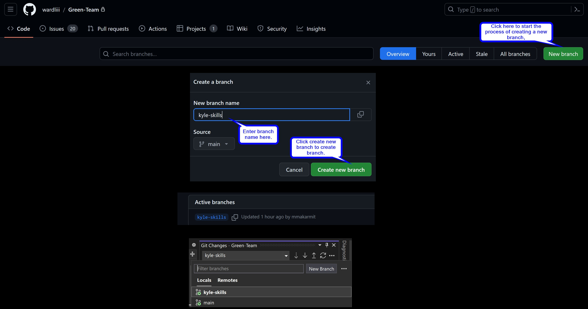

# Workflow

## Introduction

The purpose of this section of my portfolio repository is to satisfy the requirements for the 
week 3 workflow section of this software engineering course. This week we are again focusing
on some group tasks as well as solo tasks. The main focus is on workflow tools, predominantly
the workflow tools used within [GitHub](https://github.com). Moreover, we are to accept and
complete an issue each and integrate it into our project using a new branch. This section
will document these tasks and provide commentary and screenshots where necessary. Finally,
I will reflect on these tasks and express anything I found particular difficulty with. Which,
this week, was substantial!

## Workflow Tools

The first order of business within our team was to decide what our workflow was going to be.
Due to a lot of inexperienced members in our team who are completely new to GitHub, we decided
to use the standard [GitHub Flow](https://docs.github.com/en/get-started/quickstart/github-flow).
It was agreed that we could edit and expand this at a later date if required but this would be sufficient
to get started.

We are using the built in Kanban board on our teams repository project board section to accept, and
move issues into the relevant column. To do, in progress, and done. This way, the whole team can at
a glance see who is working on which issue, which issue currently needs someone to start working on, 
and which issues have been completed. To increase communication we are using [Discord](https://discord.com/) and
[WhatsApp](https://www.whatsapp.com/) as the team felt we could have a more diverse real time conversation when required, rather than using a GitHub
message board.

## Required Operations

### Accept a Task from Project Backlog

Accepting a task from the project backlog is a fairly easy step to complete. First of all I
navigated to my [team repository](https://github.com/wardliii/Green-Team), and then navigated
to the [issues page](https://github.com/wardliii/Green-Team/issues) by clicking issues on the 
top left menu of the browser. Once on the issues page, there is a list of issues displayed. I
clicked on one of my choice and was taken to a page where I could then assign that issue to myself.
For clarity, my team had also agreed to leave a comment saying, "I am going to work on this
task". This way, other team members could easily see which jobs had been taken in the list as they
had a comment attached. Please see Fig 1 below for an image of this in action.

||
|:--:|
|<b>Fig 1 - Accepting a Task from Issues</b>|

### Update the Task Information

Updating of the task information can be completed much like the previous task. I just need to 
navigate to the issues page of my team project, or the [project board](https://github.com/users/wardliii/projects/1)
of my team project and click on my issue. Both ways will open a similar page which displays all
the information about this task. From here, I can edit the title and description by clicking the
three dots and doing so. Furthermore, I can add labels, assignees, milestones, and files from here using
the relevant sections. At this stage, all I have done is assigned myself to this issue and left
a comment to inform my team of this.

### Update the Task Board

||
|:--:|
|<b>Fig 2 - Updating the Task Board</b>|

There are various versions of kanban boards online but our team decided to use the one built
into our project on GitHub. As you can see in Fig 2, the project task board is very self explanatory 
and intuitive. The left column has the tasks still to do with no one assigned to them. The middle
column has the in progress tasks which means someone has assigned themself to that task and started
it. Finally, the third column is the done column. Once the job is complete the person assigned to it should
move it to here. There is an issue currently with our project board where it is not letting
most users move anything, even though we apparently have the appropriate admin rights. This is an
issue that the team will have to rectify at the earliest possible point, but for now as a workaround,
we are just messaging one of our team leaders and they are moving the tasks around for us respectively.

### Complete the Task on a Feature Branch

The first step to completing the task on a feature branch is to physically create a branch off of the main.
To do this, I navigated to the [branches](https://github.com/wardliii/Green-Team/branches) page in my team
repository and clicked on New Branch. Once on new branch pop up, enter the desired branch name and click 
Create new branch. Once complete, I refreshed the branches pages and my new branch was there. To make it
appear in Visual Studio I synced my team repository and navigated to the Git changes bar. Clicked the arrow
to the left of main and selected Remotes, then selected the branch that I created. All of this can be seen
in Fig 3.

||
|:--:|
|<b>Fig 3 - Completing the Task on a Feature Branch</b>|

As a side note, I was not actually able to complete the development task this week as our personal and team
environments were broken all week and there is only one person in my full team that is comfortable enough with
these tools to fix anything. Therefore, I am showing that I understand how this process works this week
even though I am unsure how the development works at this stage.

### Commit Changes with Comments

||
|:--:|
|<b>Fig 4 - Committing Changes with Comments</b>|

As can be seen in Fig 4, to commit any changes made with comments, I simply navigated to the Git changes side
bar just like the previous step. Ensuring that it is my personal branch that is selected from the dropdown
and click Commit All. This will save this to my local device and once I push it to GitHub will show the comments
and the fact I committed something to my team repository for all members of my team to see.

### Check my Work Against the Definition of Done

Due to constant problems all week with my own personal environment and the team environment, my whole
team was not able to get any of the development tasks completed. This was due to our team being completely
unbalanced with what appears to be 15 inexperienced members, and 1 or 2 experienced. There was no communication
from the experienced members until very late in the week, therefore, there was no time to rectify the issues
and get the development tasks completed. Due to this we have nothing to compare to the Definition of Done
and have therefore, failed to meet these requirements.

### Making a Pull Request

As long as everything has went smoothly so far with regards to committing any changes and pushing said
changes to the GitHub repository, making a pull request is fairly straight forward. All I had to do was
again navigate to the branches page of my team repository. Once there, any branch that has made changes 
can click New pull request as in Fig 5.

||
|:--:|
|<b>Fig 5 - Making a Pull Request</b>|

After which, I was taken to the pull request page. From here I first and foremost had to ensure the branches 
being pulled from and to were correct. Once I had confirmed these were correct, I left a small comment
documenting why there was a pull request and clicked the Create pull request button as documented in
Fig 6.

||
|:--:|
|<b>Fig 6 - Continuing a Pull Request</b>|

Once the pull request is created, if the appropriate admin rights are active and the target branch is not
set to read only, then there is an option on the next page to merge pull request. Currently, my team
has the main branch set to read only so that any pull requests need to be code reviewed by the more
experience members of our team before allowing a pull request to successfully merge. After which point
the branch can then be deleted as it is no longer required.

## Reflection

I found the tasks this week to be very difficult due to having no previous experience with C#, SQLite,
GitHub, and very limited experience with Visual Studio. These gaps are meant to be bridged by having
experienced team members to buddy up with and learn from each other. This is not happening in any shape
or form in my group. There are 10 members roughly who have not communicated at all in person, or on any
of our communication mediums. Of the members who are communicating, all but two are completely new to all
of these tools and out of those two only one really knows anything substantial to help others. There was no
communication of any substance with these people after numerous attempts by myself and some other members, 
until late the night before the submission deadline. This meant we could not get the development complete or really move forward with anything and has meant I am
submitting work late, for the first time ever during my "career".

I completed the first tutorial with ease but found the second tutorial to add an SQLite database into my
environment very difficult to understand and counter intuitive. Due to not being able to communicate
with any experienced team member I didn't manage to get this done and therefore, could not fully complete
the development task. That said, I found it very difficult to understand what was even expected this week
for the portfolio and for the development task. I truly feel that the team members in my situation who came
direct from college, have been hung out to dry with this whole process.

The first few tasks; accepting a task, updating the task information, and updating the task board, were
easy and able to be done confidently. Beyond this point everything else was affected by lack of skills in
this area and bad communication within the team.

This process could be refined in the future by ensuring that teams are adequately filled with experienced
and inexperienced people to create a fair dynamic. The onus should not be on one student to keep a team
of 16 members afloat. I feel like the current procedure for updating the task is sufficient and intuitive.
As is the task board but my team needs to give the correct admin permission to the whole team so we can move
tasks around as needed. Finally, I feel we need to add a release branch for the team to make their pull
requests onto to ensure there is no unintended consequences.